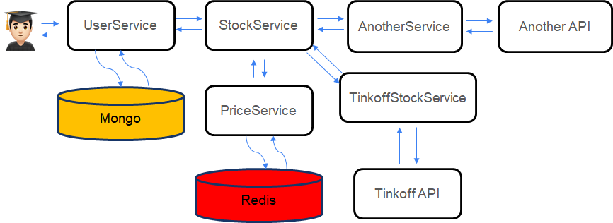

= Введение

== Оглавление

* <<_идея>>
* <<_схема_проекта_и_сценарий_использования>>
* <<_frontend,Frontend>>

== Идея

Сделать систему, которая запрашивает данные по портфелю пользователя и выдает графики для его анализа.

Стек технологий: Spring Data, Spring MVC, Spring Security, Mongo DB, Docker, Unit test

== Схема проекта и сценарий использования

*Предполагаемый сценарий использования:* с UI в User service приходит запрос получить стоимость портфеля.
По UserID, идем в БД - получаем ценные бумаги. User service =&gt; Stock service =&gt; Tinkoff service =&gt; Tinkoff API (запрашиваем цену по всем бумагам).
Tinkoff отвечает возвращаем в Stock service. Если у части бумаг нет цены, то идем в Moex stock service =&gt; MOEX API. Если нашли цены бумаг возвращаемся в Stock service. Всю информацию передаем в User service. User service выполняет 2-ой запрос, чтобы избежать цикличности цену будем запрашивать в Price service (где то кеширует цену бумаг, возможно в Redis). По итогу: выводим стоимость портфеля и рисуем графики (как пример, круговая диаграмма сколько средств вложено: в акции/облигации, какие компании имеют большую долю в портфеле).

В системе должно быть удобным создание пользователя с портфелем акций.
По тикеру система ходит на внешние API получает информацию. Она должна понимать валюту ценной бумаги, название компании, тип и тд. Пример ожидаемого json в ответ:

[,json]
----
{
  "id": "somestring",
  "ticker": "YNDX",
  "currency": "RUB",
  "name": "Yandex",
  "type": "Stock",
  "input": "Tinkoff"
}
----

Из-за отсутствия корпоративных бумаг в Tinkoff Инвестиции или других источниках важно предусмотреть, чтобы внешних ресурсов получения ценных бумаг должно быть несколько: Tinkoff Инвестиции, MOEX, Сбер Инвестиции и тд.

Для сокращения времени получения информации по ценным бумагам хранение информации о них и пользователях должно быть в БД (MongoDB?).
*Цена бумаг для аналитики должна быть актуальной!* Предусмотреть кеширование цены на несколько секунд или минут для установления цены, чтобы не бегать на биржу по каждой акции. Насколько кешировать устанавливается параметром.

== FRONTEND
Подойдет один из вариантов:

. Консоль
. Swagger
. Телеграм бот.
. Web интерфейс.
