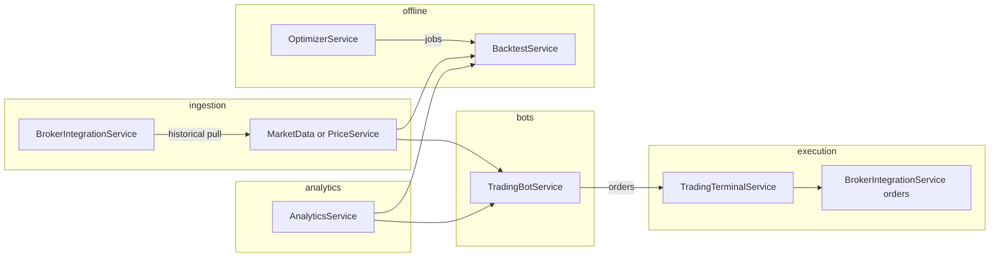

# Алгоритм трансформации FinancialSystem под модель OsEngine

Документ описывает **пошаговые алгоритмы** развития монорепозитория FinancialSystem до функциональной близости с [OsEngine](https://github.com/AlexWan/OsEngine) (слой роботов, исторические данные, тестер, оптимизатор, станция роботов) с сохранением стека **Java + Spring** и максимальным переиспользованием текущих микросервисов.

**Версия документа:** 1.1 (актуализация: сравнение архитектур OsEngine ↔ FinancialSystem, трассировка требований, решение по владельцу истории для текущего репозитория).

<a id="section-toc"></a>

## Оглавление

- [1. Цели и инварианты](#section-1)
  - [1.1. Цели](#section-1-1)
  - [1.2. Инварианты проектирования](#section-1-2)
  - [1.3. Сравнение архитектур OsEngine и FinancialSystem](#section-1-3)
  - [1.4. Требования OsEngine и трассировка на фазы (BA)](#section-1-4)
- [2. Соответствие компонентов OsEngine и модулей FinancialSystem](#section-2)
- [3. Общий алгоритм трансформации (фазы)](#section-3)
  - [Алгоритм `TRANSFORM_MASTER`](#algo-transform-master)
- [4. Фаза A: доменное ядро и исторические данные](#section-4)
  - [4.1. Алгоритм `CREATE_SHARED_LIBRARY`](#algo-create-shared-library)
  - [4.2. Алгоритм `SCHEMA_MARKET_HISTORY`](#algo-schema-market-history)
  - [4.3. Выбор ответственного сервиса за историю](#history-service-choice)
  - [4.4. Алгоритм `INGEST_HISTORICAL_CANDLES`](#algo-ingest-historical-candles)
  - [4.5. Алгоритм `QUERY_CANDLES_API`](#algo-query-candles-api)
- [5. Фаза B: абстракция стратегии и live-контур](#section-5)
  - [5.1. Алгоритм `DEFINE_STRATEGY_SPI`](#algo-define-strategy-spi)
  - [5.2. Алгоритм `BOT_TICK_LIVE`](#algo-bot-tick-live)
- [6. Фаза C: BacktestService (Tester)](#section-6)
  - [6.1. Алгоритм `BACKTEST_RUN`](#algo-backtest-run)
  - [6.2. Изоляция от брокера](#algo-broker-isolation)
- [7. Фаза D: Optimizer](#section-7)
  - [7.1. Алгоритм `OPTIMIZE_GRID_SEARCH`](#algo-optimize-grid-search)
  - [7.2. Алгоритм `JOB_ORCHESTRATION`](#algo-job-orchestration)
- [8. Фаза E: Bot Station — укрепление live](#section-8)
  - [8.1. Алгоритм `RISK_GATES_BEFORE_ORDER`](#algo-risk-gates)
  - [8.2. Алгоритм `AUDIT_STRATEGY_DECISION`](#algo-audit-strategy)
- [9. Фаза F: коннекторы и рыночный стрим (опционально)](#section-9)
  - [9.1. Алгоритм `BROKER_ADAPTER_PLUGIN`](#algo-broker-adapter-plugin)
  - [9.2. Алгоритм `PUSH_QUOTES_CLIENT`](#algo-push-quotes-client)
- [10. Изменения в существующих сервисах (чеклист)](#section-10)
- [11. Порядок миграции кода текущего `TradingBotService`](#section-11)
- [12. Минимальные критерии приёмки (Definition of Done)](#section-12)
- [13. Схема зависимостей потоков данных (ориентир)](#section-13)
- [14. Приложение: параметры конфигурации](#section-14)

---

<a id="section-1"></a>

## 1. Цели и инварианты

<a id="section-1-1"></a>

### 1.1. Цели

- Покрыть ключевые подсистемы OsEngine: **Market Data / Data**, **Strategy / Robot**, **Tester (бэктест)**, **Optimizer**, **Bot Station (live)**.
- Не дублировать логику стратегий между live и бэктестом.
- Сохранить облачную модель: **Eureka**, **ApiGateway**, **Feign**, **JWT**, отдельные БД/кеши по сервисам.

<a id="section-1-2"></a>

### 1.2. Инварианты проектирования

1. Каждый новый крупный блок либо **расширяет существующий сервис**, либо добавляется как **новый Maven-модуль** с явной ответственностью.
2. Доменные типы (свеча, интервал, идентификатор инструмента, сторона сделки) стремятся к **одной shared-библиотеке** (`fs-trading-core` или аналог), без циклических зависимостей между сервисами.
3. Бэктест и оптимизация **не вызывают боевой брокер** без явного флага окружения.

<a id="section-1-3"></a>

### 1.3. Сравнение архитектур OsEngine и FinancialSystem

| Аспект | OsEngine ([репозиторий](https://github.com/AlexWan/OsEngine)) | FinancialSystem (текущий монорепозиторий) |
|--------|----------------------------------------------------------------|---------------------------------------------|
| **Развёртывание** | Набор десктоп-приложений (.NET / C#), локальная установка | Микросервисы Spring Boot, **Eureka**, **Spring Cloud Gateway**, контейнеры / облако |
| **Данные и история** | Отдельное приложение *OData* / *Data*: загрузка свечей, стаканов, тиков из множества источников | `BrokerIntegrationService` (интеграция, в т.ч. Tinkoff), `PriceService` (актуальные цены / Redis-ориентир в плане) — **централизованного хранилища OHLCV в БД пока нет** |
| **Стратегии / роботы** | Слой скриптов (аналог Wealth-Lab / NinjaScript), обратная совместимость API | `TradingBotService`: стратегии по enum (`MACD_CROSSOVER`, `SMA_CROSSOVER`, …), расписание тиков, вызовы `AnalyticsService` и терминала |
| **Тестер** | *Tester*: эмулятор биржи, **несколько стратегий и таймфреймов**, единый портфель | Пока отсутствует как сервис → **фаза C (`BacktestService`)**, первая итерация: **один инструмент + один прогон стратегии**; мульти-инструмент / единый портфель — расширение после DoD фазы C |
| **Оптимизатор** | *Optimizer*: подбор параметров | Пока отсутствует → **фаза D** |
| **Станция роботов** | *Bot station*: запуск роботов в бой | `TradingBotService` + `TradingTerminalService` + риск/аудит (**фаза E**) |
| **Индикаторы** | Встроены в платформу роботов | `AnalyticsService` (SMA, EMA, MACD, волатильность и т.д.) |
| **Коннекторы** | Десятки бирж и data-only провайдеров | По сути **один торговый адаптер** (`TinkoffBrokerAdapter`); расширение → **фаза F** |
| **UI** | Отдельные программы под каждую роль | `DashboardService`, `AdminPanelService`, BFF под фронт через Gateway (`/api/...`) |

**Принцип подгонки:** не повторять монолитный десктопный комплект, а **сохранить микросервисные границы** и добиться **функциональной эквивалентности по сценариям** (история → бэктест → оптимизация → live с бумажным режимом), перенося общий домен в shared-модуль (`fs-trading-core`), как в фазах A–B.

**Несоответствие, принятое как осознанный scope v1:** в OsEngine Tester заявлен сценарий «много стратегий одновременно, один портфель»; в алгоритме `BACKTEST_RUN` первый релиз — **одна стратегия на один прогон**. Мульти-стратегия и общий портфель — отдельная доработка после выполнения критериев раздела [12](#section-12).

<a id="section-1-4"></a>

### 1.4. Требования OsEngine и трассировка на фазы (BA)

Ниже — выжимка **бизнес-возможностей** OsEngine (по описанию продукта и README) и привязка к фазам документа. Формулировки OsEngine не дублируют технический дизайн Java — они задают **критерий «что должно быть возможно»** после трансформации.

| Возможность OsEngine (требование уровня продукта) | Фаза(ы) в этом документе | Минимальная проверяемость |
|---------------------------------------------------|--------------------------|---------------------------|
| Загрузка и хранение исторических свечей (аналог OData) | A, F (источники) | REST чтения баров + идемпотентный ingestion |
| Единый слой стратегий без дублирования live/backtest | B, C | Один `strategyKey` в live и в `BACKTEST_RUN` |
| Прогон стратегии на истории без реальной биржи | C | Профиль/флаг изоляции брокера ([6.2](#algo-broker-isolation)) |
| Подбор параметров по сетке / job-очередь | D | Топ-K результатов, job со статусом |
| Управление роботом в бою, пауза, безопасный paper | E | `paper=true` не создаёт боевых ордеров |
| Несколько подключений к данным и брокерам | F | Второй адаптер или data-only — по приоритету |
| Индикаторы / ТА для решений робота | Уже есть + B | Вызов `AnalyticsService` из контекста стратегии |

**Согласованность (Aligned):** цели раздела [1.1](#section-1-1) покрывают строки таблицы выше; инварианты [1.2](#section-1-2) не конфликтуют с микросервисной декомпозицией OsEngine-подобных функций.

**Замечания BA (Issues):**

1. **Major — раздел 12 vs Tester OsEngine:** критерий DoD №2 говорит об одной реализации стратегии в live и backtest; **не** фиксирует мульти-стратегию и единый портфель. *Резолюция:* явный **out-of-scope для v1** — см. конец [1.3](#section-1-3); при появлении user story добавить фазу C.1 или расширить `BACKTEST_RUN`.
2. **Minor — NFR:** для Optimizer (фаза D) в тексте есть оркестрация и лимиты параллелизма; стоит дополнить ADR/NFR по **SLO времени одного прогона** и **квотам CPU** в k8s — вынести в операционную документацию, не блокируя алгоритм.
3. **Minor — терминология:** в OsEngine программа истории называется *OData* / *Data*; в документе используется `MarketDataService` / `PriceService` — в коммуникации со стейкхолдерами держать **глоссарий OsEngine ↔ FS**.

**Открытые вопросы (только при появлении новых ограничений):** нужен ли отдельный публичный API «как OData» для внешних клиентов или достаточно внутренних вызовов между сервисами — влияет на rate limit Gateway и аутентификацию.

**Рекомендуемые следующие шаги (BA + архитектура):** зафиксировать **ADR-001**: владелец истории баров (**рекомендация для текущего репозитория:** [вариант 1, раздел 4.3](#history-service-choice)); завести **epic** на фазы A→E с acceptance из таблицы выше; при необходимости поручить **robot-architect** C4 Container для обновлённого потока после появления `BacktestService`.

---

<a id="section-2"></a>

## 2. Соответствие компонентов OsEngine и модулей FinancialSystem

| Подсистема OsEngine | Назначение | Модуль(и) FinancialSystem |
|---------------------|------------|---------------------------|
| Слой роботов / стратегий | Сигналы, параметры, исполнение (скриптовый слой OsEngine) | `TradingBotService` (+ `fs-trading-core` / SPI стратегий, фаза B) |
| Data (OData) | История: бары, при необходимости тики/стакан | `BrokerIntegrationService` (pull из провайдера), **`PriceService` как владелец БД баров по умолчанию** ([4.3](#history-service-choice)) или опционально `MarketDataService` |
| Tester | Симуляция на истории, единый портфель | Новый `BacktestService` (или изолированный пакет + API) |
| Optimizer | Перебор параметров, метрики | Новый `OptimizerService` или Spring Batch + очередь |
| Bot Station | Запуск/остановка роботов в бою | `TradingBotService` + `TradingTerminalService` + `BrokerIntegrationService` |
| Индикаторы / ТА | Расчёты | `AnalyticsService` |
| Пользователи / счета | Идентичность, привязка к брокеру | `UserService` |
| UI / агрегация | Дашборд, админка | `DashboardService`, `AdminPanelService` |
| Вход / маршрутизация | API, безопасность | `ApiGateway` |

---

<a id="section-3"></a>

## 3. Общий алгоритм трансформации (фазы)

Ниже — **упорядоченный граф работ**. Переход к фазе *N+1* допускается только после выполнения критериев завершения фазы *N*.

<a id="algo-transform-master"></a>

### Алгоритм `TRANSFORM_MASTER`

```
ВХОД: текущее состояние репозитория FinancialSystem.
ВЫХОД: набор развёрнутых сервисов с функциями уровня OsEngine-lite + расширяемость.

1. Инициализировать артефакты управления:
   1.1. Зафиксировать версии JDK, Spring Boot, контракты OpenAPI между сервисами.
   1.2. Определить СУБД для исторических рядов (рекомендация: Postgres + TimescaleDB или отдельное хранилище под нагрузку).

2. ВЫПОЛНИТЬ ФАЗУ A (ядро домена + исторические бары минимально).
   Критерий: по FIGI и таймфрейму можно прочитать непрерывный ряд OHLCV за диапазон дат из API системы.

3. ВЫПОЛНИТЬ ФАЗУ B (абстракция стратегии + единый контракт для live).
   Критерий: добавление новой стратегии = новый класс/бин без правки огромного switch; параметры задаются конфигурацией.

4. ВЫПОЛНИТЬ ФАЗУ C (BacktestService: симулятор).
   Критерий: прогон той же стратегии на истории без обращения к брокеру; ответ содержит кривую equity и базовые метрики.

5. ВЫПОЛНИТЬ ФАЗУ D (Optimizer).
   Критерий: параметрическая сетка запускает N прогонов бэктеста; результат сохраняется (лидерборд параметров).

6. ВЫПОЛНИТЬ ФАЗУ E (Bot Station hardening).
   Критерий: режимы PAUSED/ACTIVE, лимиты риска, paper/live флаг на уровне бота или счёта; аудит решений робота.

7. ВЫПОЛНИТЬ ФАЗУ F (коннекторы и стриминг, по приоритету рынка).
   Критерий: второй реализованный адаптер (data-only допустимо) или WebSocket/SSE котировок для терминала.

8. Финализировать наблюдаемость и SLO:
   8.1. Метрики длительности бэктеста, очереди оптимизации, ошибок брокера.
   8.2. Политики таймаутов и повторов Feign между сервисами.

ВОЗВРАТ: задокументированные контракты API + работающие профили docker-compose/k8s (по наличию в проекте).
```

---

<a id="section-4"></a>

## 4. Фаза A: доменное ядро и исторические данные

<a id="algo-create-shared-library"></a>

### 4.1. Алгоритм `CREATE_SHARED_LIBRARY`

```
ЦЕЛЬ: один jar с типами без Spring-контекста.

1. Создать Maven-модуль fs-trading-core (packaging jar).
2. Добавить неизменяемые записи при возможности:
   - Candle(figi или instrumentKey, openTime, open, high, low, close, volume, timeframe)
   - TimeFrame enum (M1, M5, H1, D1, …)
   - OrderSide (BUY/SELL), OrderIntent (MARKET/LIMIT — по мере необходимости)
3. Добавить в parent pom зависимость с scope по умолчанию для сервисов, которым нужен домен.
4. Исключить из fs-trading-core зависимости на Spring Cloud / Feign.
5. Прогнать сборку aggregator: mvn -pl fs-trading-core install.

Критерий готовности: TradingBotService, PriceService, BacktestService (позже) зависят только от этого модуля для свечей.
```

<a id="algo-schema-market-history"></a>

### 4.2. Алгоритм `SCHEMA_MARKET_HISTORY`

```
ЦЕЛЬ: табличное хранилище баров с уникальностью по (instrument_id, timeframe, bar_open_time).

1. Выбрать СУБД (Postgres предпочтительно для транзакций и миграций Flyway/Liquibase).
2. Спроектировать таблицу market_candles:
   - PK или UNIQUE (figi, timeframe, ts_open)
   - индекс по figi + ts_open
3. Определить политику дублирования: UPSERT при повторной загрузке того же бара.

Критерий: миграция применяется автономно в сервисе, который владеет данными (см. 4.3).
```

<a id="history-service-choice"></a>

### 4.3. Выбор ответственного сервиса за историю

Два допустимых варианта (выбрать один на этапе проектирования):

- **Вариант 1.** Расширить **`PriceService`**: добавить сущность истории и REST `GET /candles`.
- **Вариант 2.** Ввести **`MarketDataService`**: ingestion + query; `PriceService` оставить для «последняя цена» и Redis.

Алгоритм выбора:

```
ЕСЛИ PriceService уже перегружен интеграциями И планируется отдельное масштабирование чтения истории:
    выбрать Вариант 2
ИНАЧЕ:
    выбрать Вариант 1 для минимизации модулей
```

**Состояние репозитория FinancialSystem (на момент 1.1):** в корневом `pom.xml` перечислены модули `PriceService`, `BrokerIntegrationService`, … без отдельного `MarketDataService` — для старта фазы A **рекомендуется Вариант 1** (расширить `PriceService`: миграции `market_candles`, `GET /candles`, ingestion по расписанию или админ-джобе). Переход на Вариант 2 оформить отдельным ADR при росте нагрузки на чтение истории или смешении ответственности «последняя цена vs архив».

<a id="algo-ingest-historical-candles"></a>

### 4.4. Алгоритм `INGEST_HISTORICAL_CANDLES`

```
ВХОД: список figi[], timeframe T, интервал [from, to].
ВЫХОД: строки в market_candles, статистика: inserted, updated, skipped, errors.

1. Для каждого figi F:
   1.1. Вызвать BrokerIntegrationService: запрос истории (новый endpoint адаптера Tinkoff или иной провайдер).
   1.2. Если ответ пуст — залогировать, перейти к следующему F.
   1.3. Нормализовать таймзону к UTC (или к биржевому стандарту проекта — едино для всей системы).
   1.4. Преобразовать ответ провайдера в Candle.
   1.5. Выполнить batch UPSERT в БД пакетами фиксированного размера (напр. 500–2000 строк).
2. Обновить кеш/метаданные последней доступной даты по (F, T) в таблице instrument_coverage (опционально).
3. Отдать суммарный отчёт в лог и/или в API ответа джобы.

Ошибки:
- Если брокер rate-limit → экспоненциальный backoff + дробление диапазона дат.
- Если частичные дыры — пометить в coverage как GAP для последующего доскачивания.
```

<a id="algo-query-candles-api"></a>

### 4.5. Алгоритм `QUERY_CANDLES_API`

```
ВХОД: figi, T, from, to, опционально limit/offset или cursor.

1. Валидировать from <= to, максимальный диапазон (anti-abuse через Gateway).
2. SELECT из market_candles с индексом по figi + ts_open.
3. ВЕРНУТЬ список Candle DTO (+ etag/If-Modified-Since при необходимости кеша CDN).

Примечание: AnalyticsService может запрашивать либо сырые цены как сейчас, либо агрегированные бары через новый клиент — решение фиксируется в Фазе B.
```

**Критерий завершения Фазы A:** для минимум одного FIGI и одного ТФ история читается из вашего API, ingestion выполняется идempotентно при повторе.

---

<a id="section-5"></a>

## 5. Фаза B: абстракция стратегии и live-контур

<a id="algo-define-strategy-spi"></a>

### 5.1. Алгоритм `DEFINE_STRATEGY_SPI`

```
ЦЕЛЬ: один интерфейс для любой стратегии.

Структура:

interface TradingStrategy {
   StrategyId id();           // ключ + версия
   StrategySignal evaluate(StrategyContext ctx);
}

StrategyContext включает:
- идентификатор робота и пользователя (или ссылки на них)
- текущее время решения (ZonedDateTime)
- последний бар / окно баров / снимок цены (минимально достаточное для текущих стратегий)
- параметры стратегии (Map или типобезопасный record)

StrategySignal включает:
- действие NONE | ENTER_LONG | ENTER_SHORT | EXIT | REDUCE ...
- необязательный размер позиции, лимиты, причину (для аудита)

1. Выделить пакет com.fs.strategy в fs-trading-core или в модуле fs-strategies-api.
2. Реализовать адаптеры существующих enum-стратегий как bean-реализации TradingStrategy.
3. В TradingBotService внедрить StrategyRegistry (по имени/id из БД находит bean).
```

<a id="algo-bot-tick-live"></a>

### 5.2. Алгоритм `BOT_TICK_LIVE`

```
Запускается по расписанию или по событию «новый бар».

ВХОД: botId
ВЫХОД: при необходимости созданный ордер; запись решения в audit log.

1. Загрузить TradingBot из БД; ЕСЛИ status != ACTIVE → выход.
2. Проверить риск-лимиты (Фаза E может расширить): max позиция, max дневной убыток, cooldown.
3. Собрать StrategyContext:
   3.1. Запросить у PriceService/MarketData последний бар или список баров нужной глубины.
   3.2. При необходимости вызвать AnalyticsService для индикаторов (MACD/SMA и т.д.).
4. Выбрать TradingStrategy через StrategyRegistry по bot.strategyKey.
5. signal = strategy.evaluate(ctx).
6. ЕСЛИ signal == NONE → выход с логом уровня DEBUG.
7. ИНАЧЕ преобразовать signal в CreateOrderDto (тип BUY/SELL, qty, цена лимита если нужна).
8. Вызвать TradingTerminalService (Feign): создать ордер.
9. Обновить состояние бота (timestamp последнего сигнала, счётчик сделок — по вашей модели).
10. При ошибке Feign применить политику: retry только для идempotent-создания с ключом клиента или без повторной отправки дубликата).
```

---

<a id="section-6"></a>

## 6. Фаза C: BacktestService (Tester)

<a id="algo-backtest-run"></a>

### 6.1. Алгоритм `BACKTEST_RUN`

```
ВХОД:
- strategyKey + parameters
- figi или набор инструментов (первый этап — один)
- timeframe T
- [from, to]
- начальный капитал C0
- модель исполнения: комиссия, спред/slippage правила

ВЫХОД:
- timeseries equity
- список сделок/s fills
- агрегированные метрики (total return, max drawdown, win rate и т.д.)

1. Инициализировать SimPortfolio:
   - cash = C0
   - positions = пусто
   - equityCurve = []

2. Загрузить все бары за период в память ЕСЛИ объём допустим; ИНАЧЕ итерировать потоково по времени:

   Для каждого бара Bi в хронологическом порядке:

   2.1. Обновить нереализованную оценку позиций по close Bi (или по mid — зафиксировать правило).
   2.2. Сформировать StrategyContext относительно окна истории до Bi (строго без lookahead: индикаторы только по данным ≤ Bi).
   2.3. signal = strategy.evaluate(ctx).

   2.4. Обработать исполнение сигналов через ExecutionModel:

        При открытии long:
           - проверить достаточность cash с учётом комиссии
           - изменить позицию, уменьшить cash на стоимость - комиссия

        При закрытии:
           - увеличить cash, обнулить/уменьшить позицию, комиссия

       Slippage: фиксированный процент от цены или N тиков (упрощение первой версии).

   2.5. Append точку equity в equityCurve.

3. После конца данных — закрыть открытые позиции по последней цене (политика «принудительное закрытие в конце теста» — явно указать в API).

4. Рассчитать метрики по equityCurve и сделкам.

5. Вернуть DTO результат + уникальный backtest_run_id сохранённый в БД (для последующего сравнения прогонов).
```

<a id="algo-broker-isolation"></a>

### 6.2. Изоляция от брокера

```
ПРЕДУСЛОВИЯ перед запуском BACKTEST_RUN:
- broker.integration.enabled=false в контексте BacktestService ИЛИ
- отдельный Spring профиль backtest без Feign-бинов к BrokerIntegrationService

ЗАПРЕТ:
- любые вызовы createRealOrder во время симуляции
```

---

<a id="section-7"></a>

## 7. Фаза D: Optimizer

<a id="algo-optimize-grid-search"></a>

### 7.1. Алгоритм `OPTIMIZE_GRID_SEARCH`

```
ВХОД:
- strategyKey
- интервалы параметров: например smaPeriod ∈ [5,50] шаг 5
- период бэктеста [from, to]
- метрика оптимизации M (например max Sharpe или min drawdown с penalty)

ВЫХОД: упорядоченный список (parameters, метрики) топ-K.

1. Сгенерировать декартово произведение параметров по сетке (осторожно с комбинаторным взрывом):
   Если размер пространства > N_max:
       применить сокращение: случайное семплирование / Bayesian — на будущее; первый этап — малая сетка.

2. Для каждого набора параметров P_i:
   2.1. Вызвать BACKTEST_RUN с P_i либо поставить задачу в очередь (рекомендуется при большом числе прогонов).

3. Сохранять каждый результат в таблицу optimization_runs(strategyKey, hash(P), metrics, timestamps).

4. Отсортировать по M; вернуть топ-K и ссылку на optimization_job_id.

5. Опционально: walk-forward — сдвигать окно времени для устранения переобучения (вторичная задача после базовой сетки).
```

<a id="algo-job-orchestration"></a>

### 7.2. Алгоритм `JOB_ORCHESTRATION`

```
При большом числе прогонов:

1. Optimizer API создаёт job в БД статус=PENDING.
2. Worker (Spring @Scheduled или отдельный процесс с spring-boot) забирает batch задач LEASE на T секунд.
3. По завершении batch обновляет прогресс; при ошибке RETRY с лимитом.
4. AdminPanelService/Dashboard могут показывать статус через REST.

Защита:
- ограничение параллелизма (Semaphore / thread pool размером W)
- таймаут одного BACKTEST_RUN
```

---

<a id="section-8"></a>

## 8. Фаза E: Bot Station — укрепление live

<a id="algo-risk-gates"></a>

### 8.1. Алгоритм `RISK_GATES_BEFORE_ORDER`

```
Перед отправкой ордера в TradingTerminalService:

1. Проверить дневной лимит убытков по данным реализованного PnL (агрегация нужна из Terminal или отчётного сервиса).
2. Проверить max размер позиции по данным UserService или кеша портфеля.
3. Проверить дубль сигнала: если последний сигнал того же типа был < Δt назад → отказ.
4. ЕСЛИ режим bot.paper=true → маршрутизировать в paper-исполнитель (локальная симуляция в TradingTerminal без брокера) ИНАЧЕ боевой путь.

ВОЗВРАТ: allow | deny(reasonCode)
```

<a id="algo-audit-strategy"></a>

### 8.2. Алгоритм `AUDIT_STRATEGY_DECISION`

```
После каждого evaluate:

1. Сохранять запись: bot_id, ts, входные параметры контекста (сжато), ключ стратегии, signal, версия параметров.
2. Ретенция данных: TTL или архивация для расследований.

Цель: дебаг расхождения live vs backtest.
```

---

<a id="section-9"></a>

## 9. Фаза F: коннекторы и рыночный стрим (опционально)

<a id="algo-broker-adapter-plugin"></a>

### 9.1. Алгоритм `BROKER_ADAPTER_PLUGIN`

```
1. Интерфейс MarketDataBrokerAdapter с методами:
   - subscribeQuotes(), unsubscribe()
   - getHistoricalCandles(figi, T, from, to)
   - health()

2. Реализация TinkoffBrokerAdapter уже существует — привести к интерфейсу.

3. Новый адаптер (напр. только MOEX ISS):
   только getHistoricalCandles + список инструментов без торговли.

4. Выбор активного адаптера через конфиг spring + опционально per-user/per-account.

```

<a id="algo-push-quotes-client"></a>

### 9.2. Алгоритм `PUSH_QUOTES_CLIENT`

```
1. По запросу клиента Dashboard открывается SSE/WebSocket канал под набор FIGI.
2. PriceService транслирует обновления из Redis или из шины событий после PriceMonitoringService.
3. Отключить клиента при таймауте; ограничить число FIGI на соединение.
```

---

<a id="section-10"></a>

## 10. Изменения в существующих сервисах (чеклист без лишней переработки)

| Модуль | Минимальные правки |
|--------|-------------------|
| `BrokerIntegrationService` | Эндпоинт исторических свечей; унификация под интерфейс адаптера |
| `PriceService` или новый сервис | Запись/чтение баров; при разделении — чёткая граница ответственности |
| `AnalyticsService` | Без побочных эффектов; приём баров там, где экономит сетевые раунды |
| `TradingBotService` | Registry стратегий, контекст, аудит |
| `TradingTerminalService` | Paper-режим, идempotency-ключ создания ордера (по мере нужды) |
| `ApiGateway` | Маршруты `/candles`, `/backtest/**`, `/optimize/**`; rate limits для тяжёлых путей |
| `DashboardService` | Виджеты статуса job’ов оптимизации и последних бэктестов |

---

<a id="section-11"></a>

## 11. Порядок миграции кода текущего `TradingBotService`

Чтобы не остановить разработку, применять **строительную лифтовую** модель:

1. Оставить `BotStrategyExecutor` работающим.
2. Ввести интерфейс `TradingStrategy` и класс `LegacyCompositeStrategy`, который делегирует старому коду по enum.
3. Постепенно переписать каждую ветку enum в отдельный класс-сингнал.
4. Удалить switch после того, как все стратегии зарегистрированы в `StrategyRegistry`.
5. Параметры стратегий вынести в таблицу `bot_strategy_params` или JSON-колонку в существующей таблице ботов с валидацией.

---

<a id="section-12"></a>

## 12. Минимальные критерии приёмки (Definition of Done) по всему проекту

1. История баров доступна через внутренний REST и используется в бэктесте без ручной подложки данных.
2. Одна реализация стратегии исполняется в live и в backtest с теми же параметрами (golden path).
3. Оптимизатор запускает ≥2 прогона подряд, результаты детерминированы при фиксированном seed симулятора (если есть стохастика).
4. Bot Station не отправляет живые ордера при включённом `paper=true`.
5. Документация OpenAPI обновлена для новых публичных путей.

---

<a id="section-13"></a>

## 13. Схема зависимостей потоков данных (ориентир)



---

<a id="section-14"></a>

## 14. Приложение: параметры конфигурации (рекомендуемые ключи)

| Ключ | Назначение |
|------|------------|
| `fs.market-history.storage` | режим jdbc / включение Timescale |
| `fs.backtest.max-bars-in-memory` | лимит защиты OOM |
| `fs.optimizer.max-concurrent-jobs` | параллелизм workers |
| `fs.bot.tick-mode` | `SCHEDULED` \| `BAR_EVENT` \| `QUOTE_EVENT` |
| `fs.bot.default-paper` | безопасный default для новых ботов |

---

*Версия документа: 1.1. Проект: FinancialSystem. Ориентир по функциональности: OsEngine (Data, Optimizer, Tester, Bot Station, слой роботов). Архитектурное сопоставление: раздел [1.3](#section-1-3).*
